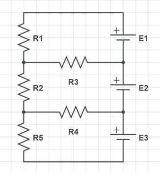
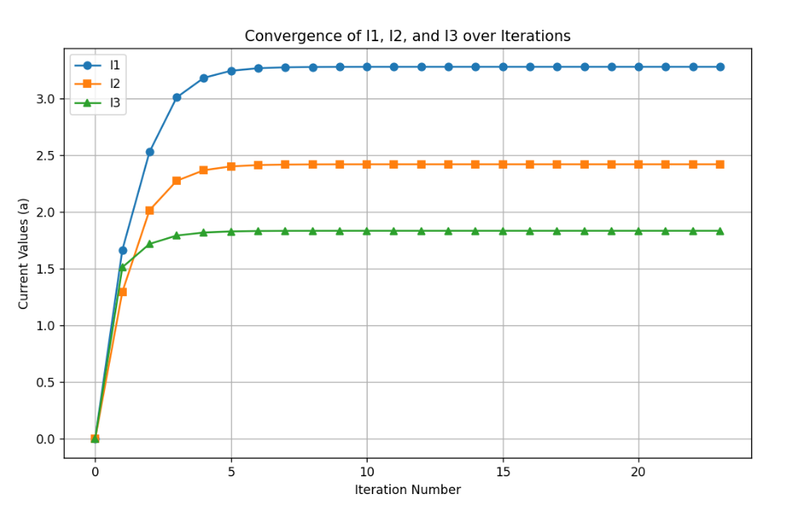

# Numerical Solution of a Three-Loop Electrical Circuit

## Overview

This project investigates the numerical solution of a three-loop electrical circuit using a system of linear equations.

The circuit equations are derived using Kirchhoff's Voltage Law (KVL), and the resulting system is solved using several numerical methods:

- Analytical solution
- Gaussian elimination
- Improved Gaussian elimination
- Gauss-Seidel iterative method

The project also examines the convergence behavior of the Gauss-Seidel method by tracking the values of the three unknown loop currents over successive iterations.

---

## Problem Description

The electrical circuit consists of three loops. Each loop contains an independent voltage source and several resistors.

  

The unknown loop currents are denoted by:

- $I_1$ — current in Loop 1
- $I_2$ — current in Loop 2
- $I_3$ — current in Loop 3

Some resistors are shared between adjacent loops. Therefore, the current through a shared resistor depends on the difference between the corresponding loop currents.

The circuit is organized as follows:

- Loop 1: Voltage source $E_1$, resistor $R_1$, and shared resistor $R_3$
- Loop 2: Voltage source $E_2$, resistor $R_2$, shared resistor $R_3$, and shared resistor $R_4$
- Loop 3: Voltage source $E_3$, resistor $R_5$, and shared resistor $R_4$

---

## Circuit Parameters

The following values are used in the numerical calculations:

| Parameter | Value |
|:---:|---:|
| $R_1$ | 2 Ω |
| $R_2$ | 3 Ω |
| $R_3$ | 4 Ω |
| $R_4$ | 2 Ω |
| $R_5$ | 5 Ω |
| $E_1$ | 10 V |
| $E_2$ | 5 V |
| $E_3$ | 8 V |

---

## Mathematical Formulation

### Kirchhoff's Voltage Law

Kirchhoff's Voltage Law states that the algebraic sum of all voltage changes around a closed electrical loop is zero.

For each loop, KVL is applied to obtain an equation involving the corresponding loop currents.

### Loop 1

For the first loop:

$$
E_1 - R_1 I_1 - R_3(I_1-I_2)=0
$$

Rearranging:

$$
(R_1+R_3)I_1-R_3I_2=E_1
$$

### Loop 2

For the second loop:

$$
E_2-R_3(I_2-I_1)-R_2I_2-R_4(I_2-I_3)=0
$$

Rearranging:

$$
-R_3I_1+(R_2+R_3+R_4)I_2-R_4I_3=E_2
$$

### Loop 3

For the third loop:

$$
E_3-R_4(I_3-I_2)-R_5I_3=0
$$

Rearranging:

$$
-R_4I_2+(R_4+R_5)I_3=E_3
$$

These equations form a system of three linear equations with three unknowns. 1

---

## System of Linear Equations

Substituting the given resistance and voltage values gives the following system:

$$
4I_1-4I_2=10
$$

$$
-4I_1+9I_2-2I_3=5
$$

$$
-2I_2+7I_3=8
$$

The system can be written in matrix form as:

$$
\begin{bmatrix}
4 & -4 & 0 \\
-4 & 9 & -2 \\
0 & -2 & 7
\end{bmatrix}
\begin{bmatrix}
I_1 \\
I_2 \\
I_3
\end{bmatrix}
=
\begin{bmatrix}
10 \\
5 \\
8
\end{bmatrix}
$$

or, more compactly,

$$
A\mathbf{I}=\mathbf{b}
$$

where

$$
A=
\begin{bmatrix}
4 & -4 & 0 \\
-4 & 9 & -2 \\
0 & -2 & 7
\end{bmatrix},
\qquad
\mathbf{I}=
\begin{bmatrix}
I_1 \\
I_2 \\
I_3
\end{bmatrix},
\qquad
\mathbf{b}=
\begin{bmatrix}
10 \\
5 \\
8
\end{bmatrix}.
$$

---

## Numerical Methods

### 1. Analytical Solution

The system is first solved algebraically to obtain the approximate values of the three loop currents.

The reported analytical results are:

$$
I_1 \approx 3.28
$$

$$
I_2 \approx 2.42
$$

$$
I_3 \approx 1.83
$$

These values provide a reference for comparison with the numerical methods. 2

---

### 2. Gaussian Elimination

Gaussian elimination is a direct numerical method for solving systems of linear equations.

The coefficient matrix is transformed into an upper triangular form through a sequence of elementary row operations. The unknowns are then obtained using back substitution.

For this three-variable system, Gaussian elimination provides a straightforward direct solution.

---

### 3. Improved Gaussian Elimination

An improved form of Gaussian elimination is also applied to the system.

The purpose of using an improved elimination procedure is to provide more reliable numerical calculations when performing the elimination process.
This method is particularly useful when numerical stability and pivot selection become important.

---

### 4. Gauss-Seidel Iterative Method

The Gauss-Seidel method is an iterative technique for solving systems of linear equations.

Starting from an initial approximation, the values of $I_1$, $I_2$, and $I_3$ are updated successively.

The general iterative process can be represented as:

$$
I_1^{(k+1)} = f_1(I_2^{(k)},I_3^{(k)})
$$

$$
I_2^{(k+1)} = f_2(I_1^{(k+1)},I_3^{(k)})
$$

$$
I_3^{(k+1)} = f_3(I_1^{(k+1)},I_2^{(k+1)})
$$

where $k$ represents the iteration number.

The process continues until the changes in the calculated values become sufficiently small.

---

## Convergence Analysis

The Gauss-Seidel method was used to investigate the convergence of the three loop currents.

The following figure shows the values of $I_1$, $I_2$, and $I_3$ over successive iterations.

  

### Interpretation

The graph shows that the three current values rapidly approach stable values during the first few iterations.

- $I_1$ increases rapidly and approaches approximately 3.28.
- $I_2$ approaches approximately 2.42.
- $I_3$ approaches approximately 1.83.
- After the initial iterations, the changes in the current values become very small.

This behavior indicates convergence of the Gauss-Seidel iterative procedure.

---

## Results

The project compares direct and iterative approaches for solving the same system of linear equations.

| Method | Type | Description |
|---|---|---|
| Analytical Solution | Direct | Algebraic solution of the system |
| Gaussian Elimination | Direct | Matrix-based elimination and back substitution |
| Improved Gaussian Elimination | Direct | Improved elimination procedure |
| Gauss-Seidel | Iterative | Repeated approximation until convergence |

The reported solution of the system is approximately:

| Current | Approximate Value |
|:---:|---:|
| $I_1$ | 3.28 |
| $I_2$ | 2.42 |
| $I_3$ | 1.83 |

---

## Comparison of Methods

### Direct Methods

Gaussian elimination and improved Gaussian elimination are direct methods. They are particularly convenient for small systems because they provide the solution through a finite sequence of computational steps.

For a three-variable system such as the one considered here, these methods are relatively simple to implement and computationally efficient.

### Iterative Method

The Gauss-Seidel method obtains the solution through successive approximations.

Its main advantage is that iterative methods can be useful for larger systems, especially when the system has a suitable structure.

However, convergence must be examined before relying on an iterative solution. The choice of the initial approximation and convergence criteria can also affect the iterative process.

---

## Technologies and Concepts

This project involves the following computational and physical concepts:
- Python
- Numerical Methods
- Linear Algebra
- Systems of Linear Equations
- Gaussian Elimination
- Gauss-Seidel Iteration
- Kirchhoff's Voltage Law
- Electrical Circuit Analysis
- Numerical Convergence
- Scientific Computing
- Data Visualization

---

## Conclusion

This project demonstrates the application of numerical methods to a system of linear equations obtained from a three-loop electrical circuit.

The circuit equations were derived using Kirchhoff's Voltage Law and subsequently solved using analytical and numerical approaches.

For small systems such as the three-variable system considered here, Gaussian elimination and improved Gaussian elimination provide straightforward direct solutions. The Gauss-Seidel method provides an iterative alternative and allows the convergence behavior of the solution to be investigated.

The convergence plot demonstrates that the three current values approach stable values after a relatively small number of iterations.

For larger systems or problems with a suitable mathematical structure, iterative methods such as Gauss-Seidel can be particularly useful, although their convergence should always be examined.
